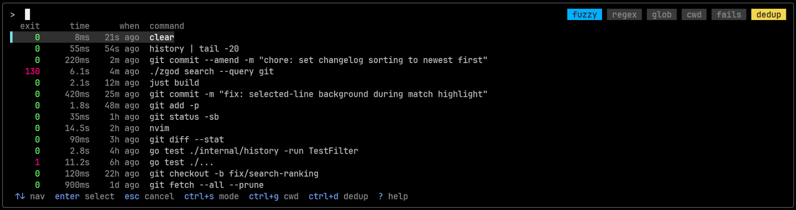

# zgod

Interactive shell history search with **fuzzy**, **regex**, and **glob** matching.

<p align="center">
  
</p>

## Features

- **Match modes:** `fuzzy` / `regex` / `glob`
- **Filters:** current directory, deduplication, failed commands only
- **History exclusion filters:** exclude commands from history recording
- **Persistent storage:** history is stored locally in `SQLite`
- **Configurable UI:** prompt, colors, layout, multiline behavior
- **Custom keybindings**
- **Supported shells:**  `bash`, `zsh`, `fish`, and `powershell`

## Usage

Press `Ctrl+R` to open the search UI. Start typing to filter results.

## Installation

### Quick install

**Unix (Linux/macOS):**

```sh
curl -fsSL https://raw.githubusercontent.com/zigai/zgod/master/install.sh | sh
```

**Windows:**

```powershell
irm https://raw.githubusercontent.com/zigai/zgod/master/install.ps1 | iex
```

### Go install

```sh
go install github.com/zigai/zgod@latest
```

### Prebuilt binaries

Download the latest binaries from the [GitHub Releases page](https://github.com/zigai/zgod/releases/latest).

### Build from source

```sh
git clone https://github.com/zigai/zgod.git
cd zgod
go build -o zgod .
```

## Setup

### Automatic

```sh
zgod install bash   # or zsh, fish, powershell
```

### Manual

If you prefer manual setup, add the snippet for your shell to your shell config file.

**Bash** (`~/.bashrc`)

```bash
if command -v zgod >/dev/null 2>&1; then eval "$(zgod init bash)"; fi
```

**Zsh** (`~/.zshrc`)

```zsh
if command -v zgod >/dev/null 2>&1; then eval "$(zgod init zsh)"; fi
```

**Fish** (`~/.config/fish/config.fish`)

```fish
type -q zgod; and zgod init fish | source
```

**PowerShell** (`$PROFILE`)

```powershell
if (Get-Command zgod -ErrorAction SilentlyContinue) { . (zgod init powershell) }
```

## Keybindings

| Key | Action |
|---|---|
| `enter` | Accept selection |
| `esc` / `ctrl+c` | Cancel |
| `up` / `ctrl+p` | Move up |
| `down` / `ctrl+n` | Move down |
| `ctrl+s` | Cycle match mode (fuzzy / regex / glob) |
| `ctrl+d` | Toggle CWD filter |
| `ctrl+g` | Toggle deduplication |
| `ctrl+f` | Toggle failed commands only |
| `alt+f` | Fuzzy mode |
| `alt+r` | Regex mode |
| `alt+g` | Glob mode |
| `alt+p` | Preview multiline command (popup mode only) |
| `?` | Help overlay |

## Configuration

Default paths:

- **Unix (Linux/macOS):**
  - config file: `~/.config/zgod/config.toml`
  - history database: `~/.local/share/zgod/history.db`
- **Windows:**
  - config file: `%APPDATA%\zgod\config.toml`
  - history database: `%LOCALAPPDATA%\zgod\history.db`

All fields are optional.

```toml
[db]
path = ""  # default: platform-specific history path (see above)

[filters]
ignore_space = true       # skip commands starting with a space
exit_code = [130]         # exit codes to skip, e.g. 130 = Ctrl+C
command_glob = []         # command glob patterns to skip, e.g. ["cd *", "ls", "exit"]
command_regex = []        # command regex patterns to skip, e.g. ["^sudo "]
directory_glob = []       # directory glob patterns to skip, e.g. ["/tmp/**"]
directory_regex = []      # directory regex patterns to skip, e.g. ["^/tmp"]
max_command_length = 0    # skip commands longer than this (0 = disabled)

[theme]
prompt = "> "
prompt_color = "cyan"
match_color = "yellow"
match_bold = true
match_underline = true
match_bg = ""
selected_bg = "24"
selected_fg = ""
selection_bar_show = true
selection_bar_char = "▌ "
selection_bar_color = "14"
selection_full_line = true
mode_color = "240"
border_color = ""

[display]
time_format = "relative"       # relative | absolute
duration_format = "auto"       # auto | ms | s
default_scope = "normal"       # normal | cwd
show_directory = false         # show directory column in search results
hide_multiline = false         # hide multiline commands from results
multiline_preview = "popup"    # popup | preview_pane | expand | collapsed
multiline_collapse = " "       # symbol to replace newlines in collapsed view

[keys]
mode_next = "ctrl+s"
mode_fuzzy = "alt+f"
mode_regex = "alt+r"
mode_glob = "alt+g"
toggle_cwd = "ctrl+d"
toggle_dedupe = "ctrl+g"
toggle_fails = "ctrl+f"
accept = "enter"
cancel = "esc"
up = "up"
down = "down"
help = "?"
preview_command = "alt+p"
```

## License

[MIT](LICENSE)
